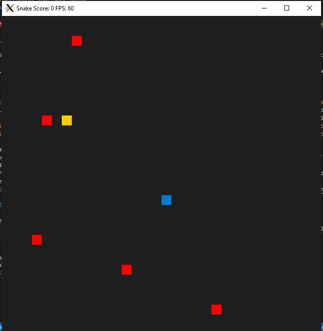
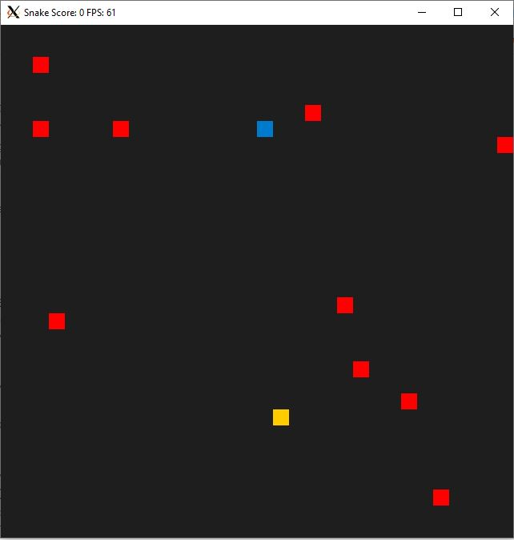
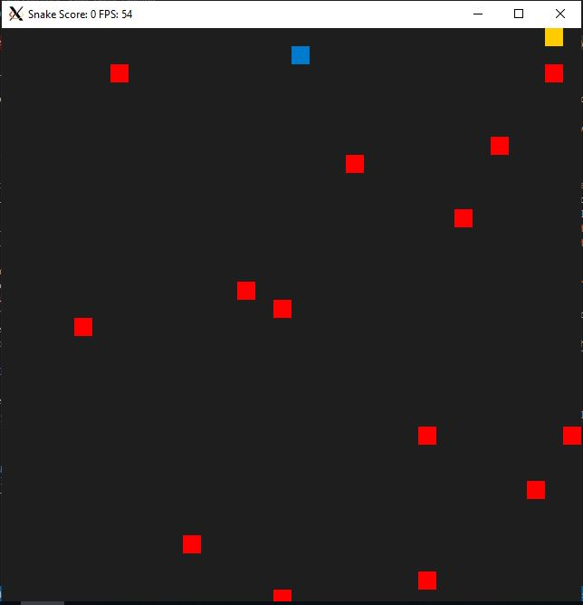

# CPPND: Capstone Snake Game Example

The code for this repo was inspired by [this](https://codereview.stackexchange.com/questions/212296/snake-game-in-c-with-sdl) excellent StackOverflow post and set of responses.

## Basic Build Instructions

1. Clone this repo.
2. Make a build directory in the top level directory: `mkdir build && cd build`
3. Compile: `cmake .. && make`
4. Run it: `./SnakeGame`.

## User Input
User is asked to choose the difficulty level before the game is started. 
With increasing difficulty, number of obstacles(red) increase as shown in pictures below.

## Dependencies for Running Locally
* cmake >= 3.7
  * All OSes: [click here for installation instructions](https://cmake.org/install/)
* make >= 4.1 (Linux, Mac), 3.81 (Windows)
  * Linux: make is installed by default on most Linux distros
  * Mac: [install Xcode command line tools to get make](https://developer.apple.com/xcode/features/)
  * Windows: [Click here for installation instructions](http://gnuwin32.sourceforge.net/packages/make.htm)
* SDL2 >= 2.0
  * All installation instructions can be found [here](https://wiki.libsdl.org/Installation)
  * Note that for Linux, an `apt` or `apt-get` installation is preferred to building from source.
* gcc/g++ >= 5.4
  * Linux: gcc / g++ is installed by default on most Linux distros
  * Mac: same deal as make - [install Xcode command line tools](https://developer.apple.com/xcode/features/)
  * Windows: recommend using [MinGW](http://www.mingw.org/)

## Criterias met

1. The project demonstrates an understanding of C++ functions and control structures.
- for loop in src/renderer.cpp (68-75)
- map data stucture in main.cpp(10-13)
- 2 vectors in main.cpp(21-22) that are used later to search inside these vectors(x and y coordinates) of obstacles to check whether the head of snake is at the obstacle (snake (67-68, 71-72)
2. The project accepts user input and processes the input.
- user input to build obstacles, data flow: 
  - from main(14-31, 41) -> game.cpp(6-8) -> snake.cpp(66-76) and also 
  - from main(39) -> renderer.cpp(8-12, 16-19, 51, 55, 56))
games.cpp takes refrences of x and y coordinates of obstacle vectors.
3. The project reads data from a file and process the data, or the program writes data to a file.
Reads best score from text file, if the file doesn't exist, it creates one and stores the latest scores. Code in main(48-70)
4. The project uses Object Oriented Programming techniques.
Sysinfo.h header that is used in main(12-13) to print OS and number of CPU cores in which game is running
5. Classes use appropriate access specifiers for class members.
In Sysinfo.h(10-21) which contains public and private variable/functions of class Sysinfo
